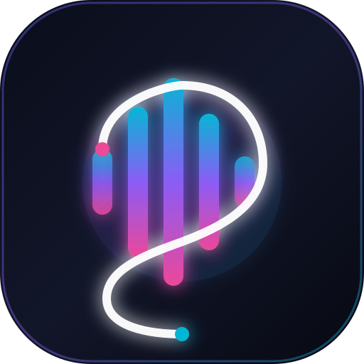

# Soniq — Seu Player de Música Pessoal

<p align="center">
  
</p>

O **Soniq** é um aplicativo pessoal de streaming de música moderno, elegante e responsivo, inspirado na ergonomia e fluxo de uso do Spotify, mas com identidade visual própria, paleta neon em tons índigo/ciano/violeta, glassmorphism e **sem anúncios publicitários inseridos pelo aplicativo**.

O aplicativo utiliza o catálogo do **YouTube** através da **YouTube Data API v3** para pesquisas e metadados, e reproduz músicas através do player oficial **YouTube IFrame Player API**.

---

## Principais Funcionalidades

- **Pesquisa Completa no YouTube:** Pesquise por títulos, artistas, álbuns ou palavras-chave com exibição de capa em alta resolução, canal e duração exata.
- **Player Oficial do YouTube:** Reprodução de faixas em áudio de alta fidelidade e janela flutuante Picture-in-Picture (PiP) para assistir aos clipes oficiais quando desejar.
- **Controles Completos de Reprodução:** Play, pause, próxima faixa, faixa anterior, seek bar (barra de progresso interativa), controle de volume com mute, modo aleatório (shuffle) e modos de repetição (desativado / repetir tudo / repetir faixa atual).
- **Fila de Reprodução Dinâmica:** Painel lateral deslizante com indicador da faixa em execução, lista de próximas músicas, reordenação e limpeza de fila.
- **Playlists Locais com IndexedDB:** Crie, edite e exclua playlists com capas e gradientes vibrantes personalizáveis.
- **Músicas Curtidas (Favoritos):** Salve músicas com um clique no botão de coração.
- **Histórico Automático:** Registro de faixas reproduzidas, quantidade de execuções e data/hora.
- **Continuação de Onde Parou:** Salva a última música e posição de reprodução no IndexedDB para restaurar sua sessão automaticamente ao abrir o app.
- **Temas Escuro e Claro:** Alternância suave entre tema dark futurista e tema light límpido.
- **Progressive Web App (PWA):** Instale o aplicativo diretamente na tela inicial do celular (Android e iOS) ou como aplicativo de desktop (Chrome, Edge, macOS).
- **100% Pessoal e Privado:** Sem necessidade de backend, contas ou cadastros externos. Todos os dados permanecem salvos no seu próprio navegador via IndexedDB.

---

## Tecnologias Utilizadas

- **Framework:** [SvelteKit](https://kit.svelte.dev/) + Svelte 5 (Runes & Stores reativas)
- **Estilização:** [Tailwind CSS v4](https://tailwindcss.com/) com design system customizado
- **Ícones:** [@lucide/svelte](https://lucide.dev/)
- **Banco de Dados Local:** [Dexie.js](https://dexie.org/) (IndexedDB)
- **APIs:**
  - YouTube Data API v3 (busca e metadados de vídeos)
  - YouTube IFrame Player API (reprodução oficial autorizada)
- **PWA:** Web App Manifest + Service Worker para cache do app shell

---

## Como Instalar e Executar

### 1. Pré-requisitos
- [Node.js](https://nodejs.org/) versão 18 ou superior instalado.

### 2. Instalação das Dependências
Na raiz do projeto, execute:
```bash
npm install
```

### 3. Executar o Servidor de Desenvolvimento
```bash
npm run dev
```
O aplicativo estará disponível em: `http://localhost:5173/`

### 4. Build de Produção
Para compilar a versão otimizada de produção:
```bash
npm run build
```
Para visualizar a build localmente:
```bash
npm run preview
```

---

## Como Configurar sua Chave da YouTube Data API v3

O Soniq já vem com um catálogo inicial demonstrativo integrado para você começar a ouvir músicas imediatamente. Para liberar a busca ilimitada de qualquer música do YouTube:

1. Acesse o [Google Cloud Console](https://console.cloud.google.com/).
2. Faça login com sua conta Google e clique em **Criar Projeto** (ex: *Soniq Music*).
3. No menu lateral, acesse **APIs e Serviços** > **Biblioteca**.
4. Pesquise por **YouTube Data API v3** e clique em **Ativar**.
5. No menu lateral, acesse **Credenciais** > **+ Criar credenciais** > **Chave de API**.
6. Copie a chave gerada.
7. No Soniq, clique no botão **Modo Demonstração** ou no ícone de engrenagem no canto superior direito.
8. Cole sua chave no campo correspondente, clique em **Testar Conexão** e depois em **Salvar Chave**.

Pronto! Sua chave fica salva exclusivamente no IndexedDB local do seu navegador.

---

## Como Instalar como PWA

### No Celular (Android - Google Chrome):
1. Acesse o link do Soniq no navegador.
2. Toque no menu de três pontos no topo do Chrome.
3. Selecione **Instalar aplicativo** ou **Adicionar à tela inicial**.

### No Celular (iPhone / iPad - Safari):
1. Acesse o link do Soniq no Safari.
2. Toque no botão de **Compartilhar** (ícone do quadrado com a seta para cima).
3. Role para baixo e selecione **Adicionar à Tela de Início**.

### No Computador (Chrome / Edge / Brave):
1. Acesse o app no navegador.
2. Clique no ícone de instalação na barra de endereços (ao lado dos favoritos) ou acesse o menu do navegador > **Instalar Soniq**.
